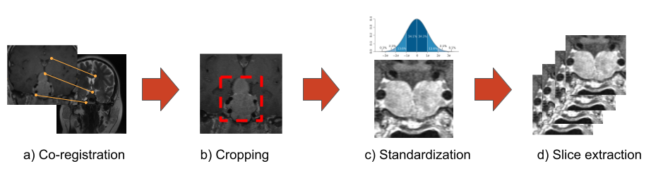
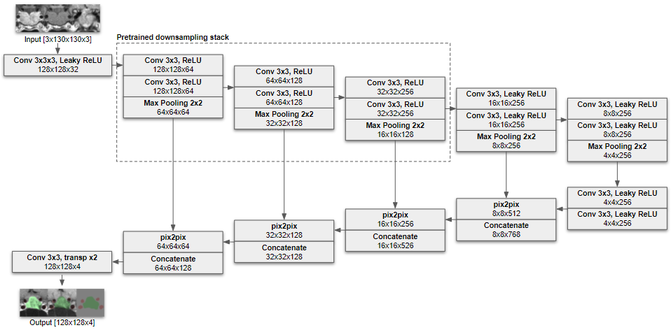
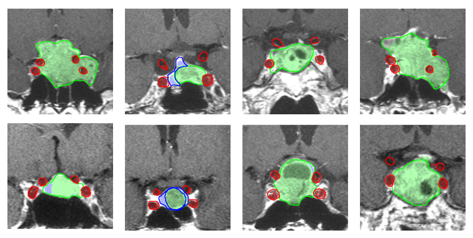

# Pituitary Adenoma Segmentation From Multimodal MRI Images
This is a code repository accompanying the article **Fully automated pipeline for pituitary adenoma segmentation: Convolutional Neural Network based model on sparsely annotated MRI** by Cerny M. et al. (not published yet)

## Usage:

pip install -r requirements.txt

python download_data.py

python 1_create_dataset.py data/config/default.yaml data/example-dataset data/dataset.h5

python 2_train_segmentation.py data/config/default.yaml data/dataset.h5 data/model

python 3_train_slice_selection.py data/config/default.yaml data/dataset.h5 data/model

python 4_train_knosp_score.py data/config/default.yaml data/dataset.h5 data/model

python 5_visualize.py data/config/default.yaml data/dataset.h5 data/model

python 6_predict.py data/config/default.yaml data/model data/example-dataset/train/1 data/example-dataset/train/1/mask_predicted.nii

